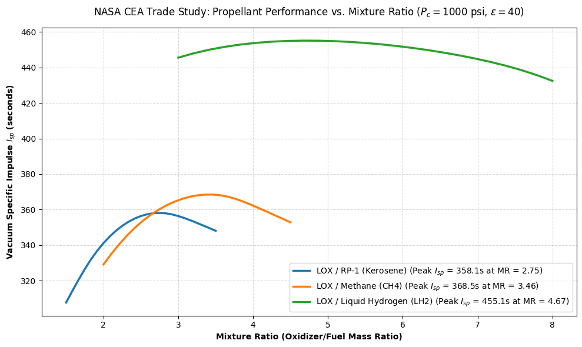

# nasa-cea-propellant-study
Thermodynamic performance study evaluating rocket propellant efficiency ($I_{sp}$) and optimal oxidizer-to-fuel mixture ratios using NASA CEA and Python.

# NASA CEA Liquid Rocket Propellant Trade Study

## Project Overview
This project is a thermodynamic trade study analyzing the performance of three industry-standard liquid rocket propellant combinations: **LOX / RP-1 (Kerosene)**, **LOX / Methane ($\text{CH}_4$)**, and **LOX / Liquid Hydrogen ($\text{LH}_2$)**. 

Using **NASA’s Chemical Equilibrium with Applications (CEA)** solver via the Python `rocketcea` wrapper, this study evaluates vacuum specific impulse ($I_{sp}$) across varying oxidizer-to-fuel ($O/F$) mixture ratios under fixed chamber pressure ($P_c = 1000\text{ psi}$) and nozzle expansion ratio ($\epsilon = 40$) conditions.

---

## Performance Summary

| Propellant Pair | Peak Vacuum $I_{sp}$ ($\text{s}$) | Optimal $O/F$ Ratio | Primary Structural & Operational Trade-Off |
| :--- | :---: | :---: | :--- |
| **LOX / RP-1 (Kerosene)** | 358.1 | 2.75 | Lowest $I_{sp}$, but highest bulk density (smaller metal propellant tanks) |
| **LOX / Methane ($\text{CH}_4$)** | 368.5 | 3.46 | $+10.4\text{s}$ $I_{sp}$ over RP-1; clean-burning for reusable engines (e.g., Starship) |
| **LOX / Liquid Hydrogen ($\text{LH}_2$)** | 455.1 | 4.67 | Maximum specific impulse; requires massive cryogenic storage tanks |

---

## Key Takeaways

1. **Specific Impulse ($I_{sp}$) vs. Molecular Mass:** Liquid Hydrogen ($\text{LH}_2$) yields the highest performance ($455.1\text{ s}$) because hydrogen exhaust products ($H_2O$ and unburned $H_2$) have an extremely low molecular weight ($M$), increasing exhaust velocity ($v_e \propto \sqrt{T/M}$).
2. **Fuel-Rich Off-Stoichiometric Peak:** Peak thermodynamic efficiency for all three propellants occurs slightly fuel-rich (lower $O/F$ than exact chemical stoichiometry). The presence of excess unburned hydrogen lowers the average molecular weight of the exhaust gas, maximizing overall $I_{sp}$.
3. **Stage Application Trade-Offs:** Although $\text{LH}_2$ is thermodynamically superior, its low bulk density requires large, heavy tanks. Consequently, denser propellants like $\text{RP-1}$ and $\text{CH}_4$ are preferred for lower/first-stage applications, while $\text{LH}_2$ dominates upper-stage applications.

---

## Repository Files
* `cea_analysis.py` — Script using `rocketcea`, `pandas`, and `matplotlib` to execute CEA equilibrium calculations and generate performance curves.
* `nasa_cea_propellant_trade_study.png` — Output visualization graph detailing $I_{sp}$ curves and peak performance points.

---

## Tools & Libraries Used
* **Thermodynamic Engine:** NASA Chemical Equilibrium with Applications (CEA)
* **Python Wrapper:** `rocketcea`
* **Data Processing & Plotting:** `pandas`, `numpy`, `matplotlib`
